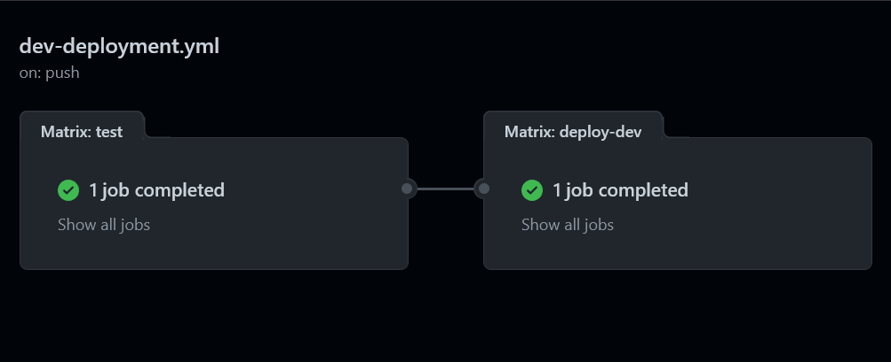

# Playlist API using Serverless Framework on AWS

A CRUD REST API for managing music playlists.

## Table of Contents

- [Playlist API using Serverless Framework on AWS](#playlist-api-using-serverless-framework-on-aws)
  - [Table of Contents](#table-of-contents)
  - [Endpoints](#endpoints)
    - [Create a playlist](#create-a-playlist)
    - [Retrieve a playlist](#retrieve-a-playlist)
    - [Retrieve all playlists](#retrieve-all-playlists)
    - [Update a playlist](#update-a-playlist)
    - [Delete a Playlist](#delete-a-playlist)
  - [Security](#security)
  - [CI/CD Pipeline](#cicd-pipeline)
  - [Local development](#local-development)
  - [Tests](#tests)
  - [Deployment](#deployment)
  - [Technologies](#technologies)
  - [Serverless plugins](#serverless-plugins)

## Endpoints

### Create a playlist

`POST /playlists`

Creates a new playlist.

Request body:

```json
{
    "name": "cool playlist name",
    "description": "cool playlist description",
    "songs": [
        {
            "name": "Song name",
            "artist": "Artist name",
            "genre": "Genre",
            "url": "https://music-url"
        }
    ]
}
```

Response body:

```json
{
  "playlist": {
    "name": "cool playlist name",
    "description": "cool playlist description",
    "songs": [
        {
            "name": "Song name",
            "artist": "Artist name",
            "genre": "Genre",
            "url": "https://music-url"
        }
    ],
    "id": "5fc80460-a180-4743-8e6b-7c10d93bc6c0",
    "createdAt": "2023-01-12T18:20:55.169Z",
    "updatedAt": "2023-01-12T18:20:55.169Z"
  }
}
```

### Retrieve a playlist

`GET /playlists/:id`

Retrieves a playlist by ID.

Response body:

```json
{
  "playlist": {
    "name": "cool playlist name",
    "description": "cool playlist description",
    "songs": [
        {
            "name": "Song name",
            "artist": "Artist name",
            "genre": "Genre",
            "url": "https://music-url"
        }
    ],
    "id": "5fc80460-a180-4743-8e6b-7c10d93bc6c0",
    "createdAt": "2023-01-12T18:20:55.169Z",
    "updatedAt": "2023-01-12T18:20:55.169Z"
  }
}
```

### Retrieve all playlists

`GET /playlists`

Retrieves all playlists.

Response body:

```json
{
  "playlists": [{
    "name": "cool playlist name",
    "description": "cool playlist description",
    "songs": [
        {
            "name": "Song name",
            "artist": "Artist name",
            "genre": "Genre",
            "url": "https://music-url"
        }
    ],
    "id": "5fc80460-a180-4743-8e6b-7c10d93bc6c0",
    "createdAt": "2023-01-12T18:20:55.169Z",
    "updatedAt": "2023-01-12T18:20:55.169Z"
  }]
}
```

### Update a playlist

`PUT /playlists/:id`

Updates a playlist by ID.

```json
{
    "name": "cool playlist name",
    "description": "cool playlist description",
    "songs": [
        {
            "name": "Song name",
            "artist": "Artist name",
            "genre": "Genre",
            "url": "https://music-url"
        }
    ]
}
```

Response body:

```json
{
  "playlist": {
    "name": "cool playlist name",
    "description": "cool playlist description",
    "songs": [
        {
            "name": "Song name",
            "artist": "Artist name",
            "genre": "Genre",
            "url": "https://music-url"
        }
    ],
    "id": "5fc80460-a180-4743-8e6b-7c10d93bc6c0",
    "createdAt": "2023-01-12T18:20:55.169Z",
    "updatedAt": "2023-01-12T18:22:55.169Z"
  }
}
```

### Delete a Playlist

`DELETE /playlists/:id`

Deletes a playlist by ID.

Response body:

```json
{
    "message": "Playlist deleted"
}
```

## Security

All of these endpoints are protected by an API key from API Gateway.

## CI/CD Pipeline

This project includes [two Github Actions workflows](./.github/workflows), one for development and another for the production environment.

The dev workflow will be automatically executed when a new push is made to a branch, it will test the code and deploy it to the dev environment.

The prod workflow will be automatically executed when a push occurs on the main branch, it will test the code, deploy it to the dev environment and then to the prod environment.




The deployment job uses the [serverless/github-action](https://github.com/serverless/github-action) to provide Serverless command the deployment of this project.

A deployment IAM user has been created in order to have AWS credentials with a basic policy to deploy all the resources using Github actions.

## Local development

```bash
npm i -D
serverless offline
```

This command will automatically build your code, start up the DynamoDB locally and start the serverless-offile plugin.

You can also use the provided `.vscode/launch.json` file to debug the code with VS Code.

## Tests

```bash
npm run test
```

The tests was developed using [Mocha](https://mochajs.org/), [Chai](https://www.chaijs.com/) and [Sinon](https://sinonjs.org/).

It also uses [Istanbul](https://istanbul.js.org/) to coverage the unit tests and generate reports of it.

## Deployment

```bash
serverless deploy --stage {dev|prd}
```

## Technologies

- [Node.js 14+](https://nodejs.org/dist/v14.21.2/)
- [Serverless](https://serverless.com)
- [Typescript](https://www.typescriptlang.org/)
- [Lambda](https://aws.amazon.com/lambda/)
- [API Gateway](https://aws.amazon.com/api-gateway/)
- [DynamoDB](https://aws.amazon.com/dynamodb/)

## Serverless plugins

- [serverless-esbuild](https://www.serverless.com/plugins/serverless-esbuild)
- [serverless-dynamodb-local](https://www.serverless.com/plugins/serverless-dynamodb-local)
- [serverless-iam-roles-per-function](https://www.serverless.com/plugins/serverless-iam-roles-per-function)
- [serverless-offline](https://www.serverless.com/plugins/serverless-offline)
